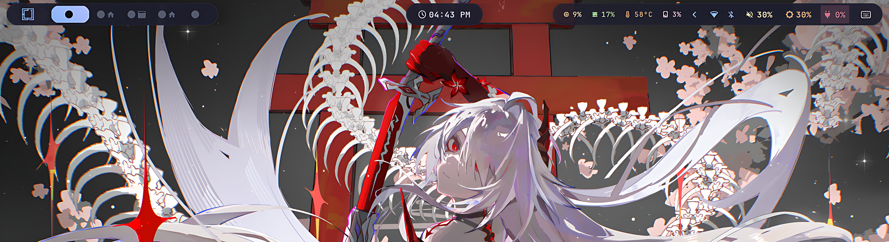

# 🌌 Waybar 2: Floating Catppuccin Islands



> [!NOTE]
> **Theme Context**: The system theme visible in the background is [Nihil-Omarchy](https://github.com/omptra/Nihil-Omarchy). Follow the link for more details!

## ✨ Vibe & Design
Welcome to the **Waybar 2** configuration—a premium status bar designed for the **Omarchy OS** / **Hyprland** environment. This setup moves away from the traditional solid bar in favor of a modern "pilled" island design with glassmorphism effects.

- **🎨 Aesthetic**: Floating pilled capsules with semi-transparent backgrounds and smooth rounded corners.
- **🌈 Palette**: **Catppuccin Mocha** palette featuring soft pastels (Blue, Green, Yellow, Flamingo) on a deep, dark base.
- **📏 Layout**: 
  - **Left**: Core navigation (OM-Menu, Dynamic Workspaces).
  - **Center**: Minimalist time and calendar island.
  - **Right**: Media control, system drawer, and essential hardware toggles.

## 🛠️ Active Modules Breakdown

### 🖱️ Left: Navigation
- **`custom/omarchy`**: A custom "omarchy" branded icon to trigger your application menu.
- **`hyprland/workspaces`**: Minimalist icons (󰖟, , ) that change color based on activity, with smooth transitions and persistent indicators for the first 5 desktops. **Supports mouse-wheel scrolling!**

### ⏰ Center: Utility
- **`clock`**: Clean digital clock that reveals a detailed calendar and month view on click/hover.

### 📊 Right: System & Media
- **`mpris`**: Music controls sharing artist/title info with interactive playback (Left: Play/Pause, Right: Next, Middle: Prev).
- **System Drawer (``)**: A collapsible container that hides/shows advanced system metrics (CPU, Memory, Temp, Disk) to keep the bar clean.
- **Controls**: Interactive icons for Volume, Brightness, and Battery level (with animation for critical battery states).
- **Tray**: Standard system tray for app indicators.

## 📦 Prerequisites & Setup

### Fonts 🔠
To render icons and text correctly, please ensure these are installed:
- **[JetBrainsMono Nerd Font](https://github.com/ryanoasis/nerd-fonts)**: Primary system and icon font.
- **Omarchy Custom Font**: Required for the launcher logo.

### Dependencies 📦
For full feature support, install these utilities:
- `waybar` (with Hyprland support)
- `playerctl` (Media control)
- `brightnessctl` (Backlight control)
- `swaync` (Notification center)
- `btop` (System monitoring)

## 🚀 How to Apply
1. **Backup**: `mv ~/.config/waybar ~/.config/waybar_backup`
2. **Deploy**: Copy `config.jsonc` and `style.css` to `~/.config/waybar/`.
3. **Reload**: Use the Omarchy reset command or restart manually:
    ```bash
    omarchy-restart-waybar
    ```
    *Manual:* `killall waybar && waybar &`

---
*Part of the [Hyprland Dotfiles](https://github.com/omptra/hyprland-dot-files) collection.*

